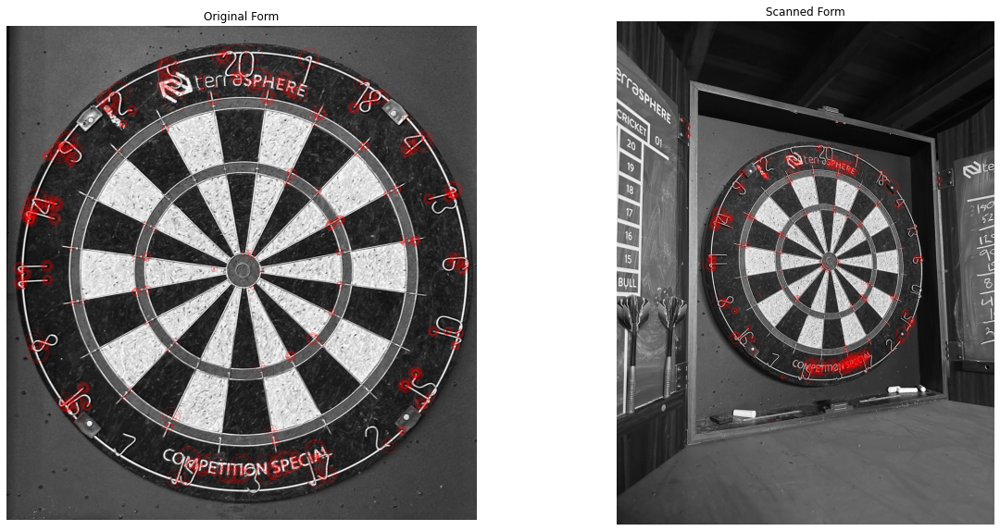

### README.md - DartScoreTracker: A C++ Application for Recording Dart Scores in Cricket

#### Overview

DartScoreTracker is an ongoing collaborative project. Our goal is to create a robust C++ application that leverages image processing techniques to automatically record scores on a dartboard. The project is being prototyped in Python for rapid development and testing, with plans to port to C++ for deployment on single-board computers for enhanced performance. Using data from this application and manually data annotation, will train a model to outpreform while still using one camera.

#### How It Works

The application utilizes a camera to continuously monitor a dartboard. Through  image processing algorithms, it detects darts' positions on the board after each throw and calculates the corresponding scores based on darts rules. Efforts are being made to make bounding boxes around each dart and identify the tip specifically. Additionally, we are exploring color filters and forms to normalize lighting and reduce shadows, ensuring consistent and accurate dart detection. The scores are then displayed in real-time, providing players with instant feedback on their performance.

#### System Setup

- **Camera Setup**: A high-definition camera is mounted with a clear view of the dartboard. It should be positioned to minimize occlusions and ensure consistent lighting for accurate dart detection.
- **Software Requirements**: The application is built using OpenCV for image processing. Users will need to install OpenCV and compile the application from source.

#### Project Structure


Here's the updated README.md content you requested, with the inclusion of image references and additional project details. You can copy and paste this markdown code directly into your README.md file. Remember to replace the ??? with triple backticks for proper code formatting when you edit the file outside of this chat:

markdown
Copy code
### README.md - DartScoreTracker: A C++ Application for Recording Dart Scores in Cricket

#### Overview

DartScoreTracker is an ongoing collaborative project developed by myself and a friend from computer science. Our goal is to create a robust C++ application that leverages image processing techniques to automatically record scores in the game of Cricket played on a dartboard. This project aims to bridge the gap between traditional dart scoring methods and modern technology, providing a seamless and automated way to track scores, enhance accuracy, and improve the overall gaming experience. The project is being prototyped in Python for rapid development and testing, with plans to port to C++ for deployment on single-board computers for enhanced performance.

#### How It Works

The application utilizes a camera to continuously monitor a dartboard. Through advanced image processing algorithms, it detects darts' positions on the board after each throw and calculates the corresponding scores based on Cricket rules. Efforts are being made to make bounding boxes around each dart and identify the tip specifically. Additionally, we are exploring color filters and forms to normalize lighting and reduce shadows, ensuring consistent and accurate dart detection. The scores are then displayed in real-time, providing players with instant feedback on their performance.

#### System Setup

- **Camera Setup**: A high-definition camera is mounted with a clear view of the dartboard. It should be positioned to minimize occlusions and ensure consistent lighting for accurate dart detection.
- **Software Requirements**: The application is built using C++ with OpenCV for image processing. Users will need to install OpenCV and compile the application from source.
- **Running the Application**: After compiling, the application can be started before beginning a game of Cricket. The camera feed is analyzed in real-time, with scores updated after each throw.

#### Project Structure
```
Project Directory
│
├── CPP
│ ├── Database.cpp
│ ├── DatabaseOperations.h
│ ├── ImageCapture.cpp
│ ├── ImageCapture.h
│ ├── ImageInitialiser.cpp
│ ├── ImageInitialiser.h
│ ├── ImageProcessing.cpp
│ ├── ImageProcessing.h
│ ├── main.cpp
│ ├── ScoreCalculator.cpp
│ ├── ScoreCalculator.h
│ ├── Validator.cpp
│ └── Validator.h
│
├── Python
│ ├── db.py
│ ├── image_initialiser.py
│ ├── image_capture.py
│ ├── image_processing.py
│ ├── main.py
│ ├── score_calculator.py
│ └── validator.py
│
├── images
│ ├── Overlay_DartBoard.png
│ ├── Feature_DartBoard.png
│ ├── Warped_DartBoard.png
│ └── example_dart-3.jpg
│
└── README.md
```

#### Images

- **Feature Selection on Dartboard**: <br>  <br> - This image shows the feature selection process to warp the photo using OpenCV.
- **Warped Dartboard**: <br>  <br> - The result of the feature selection to warp the board.
- **Original Dartboard on an Angle**: <br>  <br> - The original photo on an angle with the darts before it was warped.
- **Overlay Dartboard**: <br>  <br> - Shows the positions overlayed on a face-on dartboard, using the difference in colors from the empty dartboard on an angle.
- **Scan Dartboard Circles** <br>  <br> This image shows the result of scanning the dartboard circles using image processing algorithms.

#### To-Do List

- [ ] Implement the camera feed capture module.
- [ ] Develop the dart detection algorithm.
- [ ] Create the score calculation logic based on Cricket rules.
- [ ] Design a user interface to display real-time scores and game statistics.
- [ ] Test the application in various lighting and setup conditions to ensure reliability.
- [ ] Optimize performance for real-time processing.

#### Expected Performance and Limitations

The application aims to achieve high accuracy in dart detection and score calculation under optimal conditions. However, performance may vary based on several factors such as lighting, camera quality, and dartboard visibility. Further testing and optimization will be conducted to address these challenges.

#### Contribution

This project is open to contributions. We welcome suggestions, improvements, and bug fixes. Please feel free to fork the repository, make changes, and submit pull requests.

#### License

This project is licensed under the MIT License - see the LICENSE file for details.
